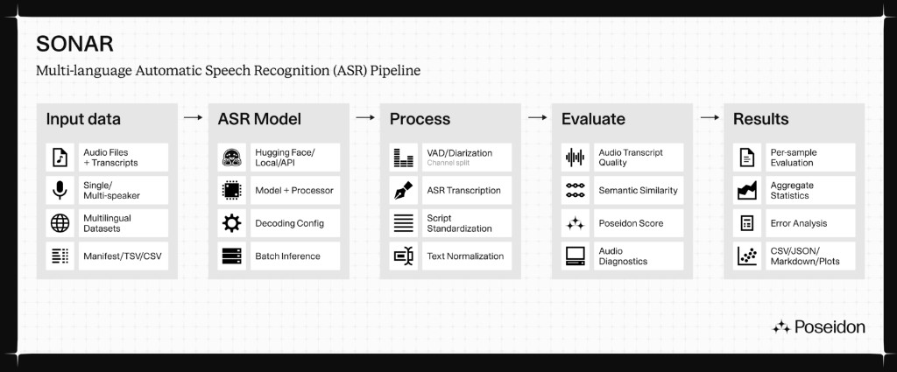

<div align="center">

# SONAR-OSS

**Multi-language ASR evaluation — built for the languages most benchmarks forget.**

[](https://github.com/PSDN-AI/SONAR-OSS/actions/workflows/ci.yml)
[](https://pypi.org/project/psdn-sonar/)
[](https://pypi.org/project/psdn-sonar/)
[](LICENSE)
[](https://github.com/PSDN-AI/SONAR-OSS/stargazers)
[](https://x.com/psdnai)

[**Website**](https://psdn.ai) · [**X / Twitter**](https://x.com/psdnai) · [**LinkedIn**](https://www.linkedin.com/company/psdnai) · [**Package (PyPI)**](https://pypi.org/project/psdn-sonar/) · [**Usage guide**](docs/USAGE.md) · [**FAQ**](docs/FAQ.md)

</div>

SONAR-OSS is [Poseidon](https://psdn.ai)'s open-source toolkit for evaluating
automatic speech recognition (ASR) models — metrics, reporting, and
benchmarks, distributed as the `psdn-sonar` Python package. Point it at your
audio and reference transcripts, pick models (local HuggingFace checkpoints or
hosted APIs like OpenAI Whisper, ElevenLabs, and AssemblyAI), and it produces
per-sample and aggregate scores you can actually compare: WER/CER under
language-specific normalization contracts, semantic similarity, the composite
POSEIDON score, audio-quality diagnostics, and latency — with every run's
model revision, device, and normalization recorded in the artifact so the
numbers stay reproducible.

Where SONAR-OSS earns its keep is off the beaten benchmark path:

- **Low-resource languages first.** Bengali, Hindi, and Korean ship with
  curated model defaults and dedicated normalizers alongside English; any
  other language runs through a YAML recipe (`psdn-sonar custom`) — adding a
  language means writing config, not code.
- **Single- and multi-speaker evaluation.** The multi-speaker pipeline
  handles VAD, diarization, and channel-split preprocessing (pyannote), and
  scores the pipeline end to end.
- **Scores you can defend.** Artifacts carry lineage (checkpoint SHA,
  normalization contract, device) and machine-readable warnings; nothing is
  back-solved or invented. `psdn-sonar leaderboard` renders a comparison
  table from measured runs only.
- **One CLI for the whole loop.** `discover` prepares datasets, `single` /
  `multi` / `custom` evaluate, `leaderboard` compares — CSV, JSON, Markdown,
  and plots out.



If SONAR-OSS is useful to you, **please
[⭐ star the repo](https://github.com/PSDN-AI/SONAR-OSS/stargazers)** — it
helps other voice-AI teams find it and tells us where to invest.

> **Status: pre-release.** The library (metrics, language processors, dataset
> loaders, evaluators, reporting, CLI) is in place and heading toward a first
> `0.1.0` release; see [`CHANGELOG.md`](CHANGELOG.md). Content imported from
> the upstream codebase passes the checklist in
> [`docs/import-gate.md`](docs/import-gate.md).

## Table of contents

- [Requirements](#requirements)
- [Installation](#installation)
  - [Install from PyPI](#install-from-pypi)
  - [Contributor install (from source)](#contributor-install-from-source)
  - [API keys and gated models](#api-keys-and-gated-models)
- [Usage](#usage)
- [Development](#development)
- [Community and links](#community-and-links)
- [License](#license)

## Requirements

- Python 3.10–3.12
- [`uv`](https://docs.astral.sh/uv/) (recommended) or `pip`
- `ffmpeg` **required** by the pipeline-based ASR adapters — including the
  English defaults `whisper_base_en` / `whisper_small_en` and any `--hf-model`
  that falls back to the generic pipeline — for **all** audio input, WAV
  included (the package decodes every input file with `ffmpeg` itself and
  hands the pipeline a raw array, so one decoder covers WAV, M4A/AAC and
  everything else). These adapters refuse to load without it and name the
  missing binary. Adapters that decode through libsndfile (the `wav2vec2_*`
  models and the non-pipeline Whisper fine-tunes) evaluate WAV and FLAC —
  and MP3, with the libsndfile ≥ 1.1 that current `soundfile` wheels bundle —
  without `ffmpeg`; formats libsndfile cannot read (M4A/AAC) and `pydub`
  silence-trimming of non-WAV input still need it. Install: `sudo apt-get
  install ffmpeg` (Debian/Ubuntu) or `brew install ffmpeg` (macOS). The
  `[pyannote]` extra needs `ffmpeg` too: pyannote.audio 4.x decodes audio
  through torchcodec, which loads the system ffmpeg libraries at runtime

**Supported environments.** CI validates Linux x86_64 with CPython 3.10, 3.11,
and 3.12, plus macOS arm64 with CPython 3.12 and the `[ml]` extra installed
(so the HuggingFace model adapters are exercised on every PR, not just
importable). Windows is expected to work for the core package but is not
CI-validated; some optional extras have platform-sensitive dependencies
(`[korean]` needs a Java runtime at runtime, `[ml]`/`[pyannote]` pull large
PyTorch trees). Open an issue if an install fails on a supported Python.
The checked-in `.python-version` pins `uv` to CPython 3.12, so `make setup`
on a machine with no Python selected builds a supported interpreter instead
of whatever newest version `uv` manages (CI passes `--python` explicitly and
is unaffected).

**What a first run costs.** On a fresh machine, budget several gigabytes of
downloads and tens of minutes before the first number appears; everything is
cached, so later runs against the same data and models start in seconds.
Measured example (Bengali FLEURS + one CTC model): ~3.4 GB / ~27 min for the
dataset, 1.26 GB for the model checkpoint, and ~1.5 GB on disk for the `[ml]`
extra (torch alone ~0.5 GB). `psdn-sonar discover --max-samples` bounds how
many samples are *prepared*, not the download — each requested split is
fetched into the HuggingFace cache in full on first run. Two more downloads
happen lazily: the first POSEIDON / semantic-similarity call fetches the
~64 MB sentence-transformers scorer, and audio-quality analysis fetches a
~390 MB UTMOS checkpoint via `torch.hub`. Checkpoint size can also hide
behind an adapter: `khushids_bengali` is a 62 MB PEFT adapter whose
`openai/whisper-large-v3` base adds ~2.9 GB.

**Compute device and runtime.** Local HuggingFace adapters auto-select the
best available device — CUDA, then MPS (Apple Silicon), then CPU — and the
device used is recorded in each run's `scores_<model>.json` (`submission.device`),
since a GPU run and a CPU run can produce different transcripts for the same
audio. On CPU, architecture dominates runtime: measured on the same
200-utterance FLEURS Bengali set, a Wav2Vec2 CTC model ran at ~1.2 s/sample
while a Whisper-medium fine-tune ran at ~19 s/sample. A full multi-model
language default (Bengali has 9 models, mostly Whisper-class) is a
multi-hour job without a GPU — trim `--models` and `--max-samples` to size
your run first.

## Installation

### Install from PyPI

Requires Python 3.10, 3.11, or 3.12.

1. Create and activate a fresh virtual environment. These examples use
   Python 3.12; substitute 3.10 or 3.11 if needed.

   macOS or Linux (bash/zsh):

   ```bash
   python3.12 --version
   python3.12 -m venv sonar-env
   source sonar-env/bin/activate
   ```

   Windows PowerShell:

   ```powershell
   py -3.12 --version
   py -3.12 -m venv sonar-env
   .\sonar-env\Scripts\Activate.ps1
   ```

2. Install the package:

   ```bash
   python -m pip install psdn-sonar
   ```

   To install an optional extra, name it in brackets — for example
   `python -m pip install "psdn-sonar[ml]"` for the local-model backends.
   [`CONTRIBUTING.md`](CONTRIBUTING.md) lists every extra and what it pulls in.

3. Verify the install:

   ```bash
   psdn-sonar --version
   python -c "import psdn_sonar; print(psdn_sonar.__version__)"
   ```

Then follow [`docs/USAGE.md`](docs/USAGE.md) for runnable examples.

### Contributor install (from source)

Contributors install the frozen, locked environment (exactly what CI runs):

```bash
git clone https://github.com/PSDN-AI/SONAR-OSS.git
cd SONAR-OSS
make setup            # uv sync --frozen with dev extras — does NOT include [ml]
# or, to run the docs/USAGE.md examples (local models, semantic similarity):
make setup-ml         # dev + [ml] extras, ~1.5 GB on disk
source .venv/bin/activate
```

Or with plain pip (editable, freshly resolved). **Create and activate a
virtual environment first** — exactly as in step 1 of the PyPI install
section above. On "externally managed" interpreters (PEP 668: Homebrew and
Debian/Ubuntu system Pythons) pip otherwise refuses with
`error: externally-managed-environment` and installs nothing:

```bash
pip install -e ".[dev]"       # contributor tooling only — no [ml]
pip install -e ".[dev,ml]"    # what the docs/USAGE.md examples need
```

The `[ml]` extra is what runs local HuggingFace models and POSEIDON's
semantic similarity; without it the USAGE examples fail with a `TypeError`
naming the extra. Add it to an existing `make setup` environment with
`uv pip install -e ".[ml]"`.

One model in the Bengali defaults needs more than `[ml]`: `khushids_bengali`
is a PEFT/LoRA adapter and requires `peft` from the `[bengali]` extra
(`pip install "psdn-sonar[bengali]"`). Without it, a `--language bn` run
skips that model with a message naming the extra and evaluates the rest of
the defaults; one unavailable model never aborts a multi-model run.

Note that `pip` does not read `uv.lock`: pip installs resolve dependency
versions fresh from PyPI within the ranges in `pyproject.toml`, so they are
not byte-for-byte reproducible the way `uv sync --frozen` is. This is the
normal contract for downstream package installs; use `uv` when you need the
locked contributor environment.

### API keys and gated models

Copy `.env.example` to `.env` and fill in only the values you need (API keys
are required only for optional hosted-model backends). For pyannote
VAD/diarization, setting `HF_TOKEN` is not enough on its own: the pyannote
models are gated on HuggingFace, so the token's account must also accept the
user conditions on each model page —
[`pyannote/segmentation-3.0`](https://huggingface.co/pyannote/segmentation-3.0),
[`pyannote/speaker-diarization-3.1`](https://huggingface.co/pyannote/speaker-diarization-3.1),
and
[`pyannote/speaker-diarization-community-1`](https://huggingface.co/pyannote/speaker-diarization-community-1)
(the diarization pipeline downloads the third as a gated dependency under
pyannote.audio 4.x, even though no command names it) — otherwise runs fail
with `403 ... not in the authorized list` even though the token is valid.

The LLM-judged metrics (entity preservation and intent pass rate, importable
from `psdn_sonar.utils.llm_metrics` — a library-only surface with no CLI
subcommand) read `GEMINI_API_KEY` (preferred) or `GOOGLE_API_KEY` as an
alternative. A `.env` entry and an exported variable both work, same as the
other API keys; when the same name is set in both places, the exported
variable wins, so a per-run `env GEMINI_API_KEY=... psdn-sonar ...` prefix
overrides the checkout's `.env`.

## Usage

See [`docs/USAGE.md`](docs/USAGE.md) for a short quickstart with runnable
examples (scoring a pair, evaluating a model over a dataset, listing models),
and [`docs/FAQ.md`](docs/FAQ.md) for common workflows: CLI commands, required
input files, output layout, and how success is measured.

Before comparing published numbers, read
[`docs/SCORE_INTERPRETATION.md`](docs/SCORE_INTERPRETATION.md): what the
scores measure — multi-speaker results include preprocessing error, scores
are comparable within a dataset only, and cells where a model is evaluated
on its declared training corpus carry an in-domain marker.

## Development

```bash
make lint              # ruff lint + format check
make typecheck         # ty type checker
make test              # pytest
make pre-commit-install
make check-internal-refs
```

See [`CONTRIBUTING.md`](CONTRIBUTING.md) for the full contributor guide,
including PR title conventions and the import gate.

## Community and links

- Website: [psdn.ai](https://psdn.ai)
- X / Twitter: [@psdnai](https://x.com/psdnai)
- LinkedIn: [Poseidon](https://www.linkedin.com/company/psdnai)
- Issues and feature requests: [GitHub issues](https://github.com/PSDN-AI/SONAR-OSS/issues)

## License

MIT — see [`LICENSE`](LICENSE).
