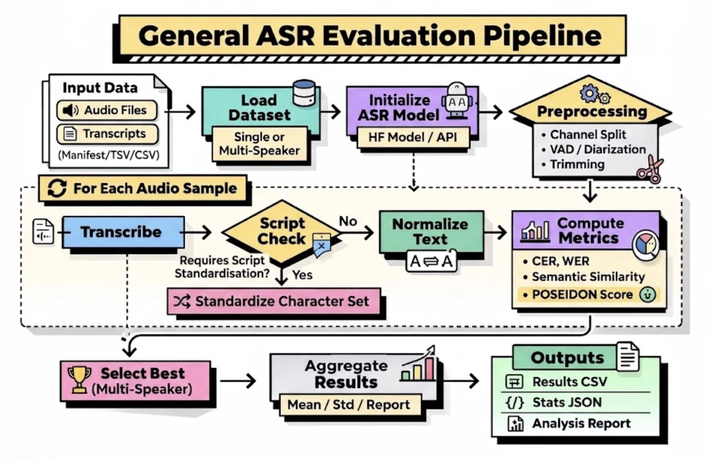

# SONAR-OSS

Multi-language ASR (automatic speech recognition) evaluation toolkit — metrics,
reporting, and benchmarks. Distributed as the `psdn-sonar` Python package.



> **Status: pre-release.** The library (metrics, language processors, dataset
> loaders, evaluators, reporting, CLI) is in place and heading toward a first
> `0.1.0` release; see [`CHANGELOG.md`](CHANGELOG.md). Content imported from
> the upstream codebase passes the checklist in
> [`docs/import-gate.md`](docs/import-gate.md).

## Requirements

- Python 3.10–3.12
- [`uv`](https://docs.astral.sh/uv/) (recommended) or `pip`

**Supported environments.** CI validates Linux x86_64 with CPython 3.10, 3.11,
and 3.12. macOS and Windows are expected to work for the core package but are
not CI-validated; some optional extras have platform-sensitive dependencies
(`[korean]` needs a Java runtime at runtime, `[ml]`/`[pyannote]` pull large
PyTorch trees). Open an issue if an install fails on a supported Python.

## Installation

### Install the pre-release from TestPyPI (for testing)

The current pre-release (`0.1.0.dev2`) is published to
[TestPyPI](https://test.pypi.org/project/psdn-sonar/), not yet to PyPI. To
install the package exactly as released:

1. Create and activate a fresh Python 3.10–3.12 virtual environment. These
   examples use Python 3.12; substitute 3.10 or 3.11 if needed.

   macOS or Linux (bash/zsh):

   ```bash
   python3.12 --version
   python3.12 -m venv sonar-env
   source sonar-env/bin/activate
   ```

   Windows PowerShell:

   ```powershell
   py -3.12 --version
   py -3.12 -m venv sonar-env
   .\sonar-env\Scripts\Activate.ps1
   ```

2. Download only the released wheel from TestPyPI, without resolving its
   dependencies:

   ```text
   python -m pip download --index-url https://test.pypi.org/simple/ --no-deps --only-binary=:all: --no-cache-dir --dest testpypi-dist "psdn-sonar==0.1.0.dev2"
   ```

3. Install that wheel, resolving dependencies from PyPI only:

   ```text
   python -m pip install --index-url https://pypi.org/simple/ --no-cache-dir "testpypi-dist/psdn_sonar-0.1.0.dev2-py3-none-any.whl"
   ```

4. Verify the install:

   ```bash
   psdn-sonar --version                                           # psdn-sonar 0.1.0.dev2
   python -c "import psdn_sonar; print(psdn_sonar.__version__)"   # 0.1.0.dev2
   ```

Then follow [`docs/USAGE.md`](docs/USAGE.md) for runnable examples. To install
an optional extra in step 3, append it to the wheel path, for example
`"testpypi-dist/psdn_sonar-0.1.0.dev2-py3-none-any.whl[ml]"`. Once `0.1.0` is
released, this section becomes a plain `pip install psdn-sonar`.

### Contributor install (from source)

Contributors install the frozen, locked environment (exactly what CI runs):

```bash
git clone https://github.com/PSDN-AI/SONAR-OSS.git
cd SONAR-OSS
make setup            # uv sync --frozen with dev extras
source .venv/bin/activate
```

Or with plain pip (editable, freshly resolved):

```bash
pip install -e ".[dev]"
```

Note that `pip` does not read `uv.lock`: pip installs resolve dependency
versions fresh from PyPI within the ranges in `pyproject.toml`, so they are
not byte-for-byte reproducible the way `uv sync --frozen` is. This is the
normal contract for downstream package installs; use `uv` when you need the
locked contributor environment.

Copy `.env.example` to `.env` and fill in only the values you need (API keys
are required only for optional hosted-model backends).

## Usage

See [`docs/USAGE.md`](docs/USAGE.md) for a short quickstart with runnable
examples (scoring a pair, evaluating a model over a dataset, listing models),
and [`docs/FAQ.md`](docs/FAQ.md) for common workflows: CLI commands, required
input files, output layout, and how success is measured.

## Development

```bash
make lint              # ruff lint + format check
make typecheck         # ty type checker
make test              # pytest
make pre-commit-install
make check-internal-refs
```

See [`CONTRIBUTING.md`](CONTRIBUTING.md) for the full contributor guide,
including PR title conventions and the import gate.

## License

MIT — see [`LICENSE`](LICENSE).
